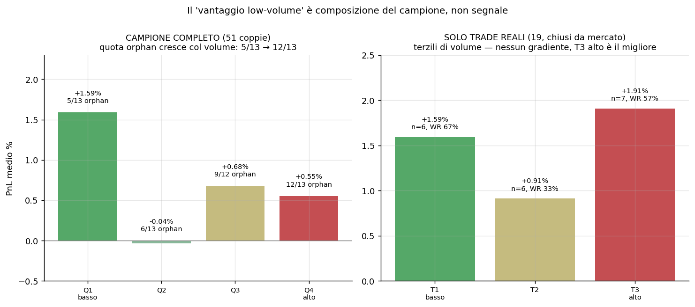
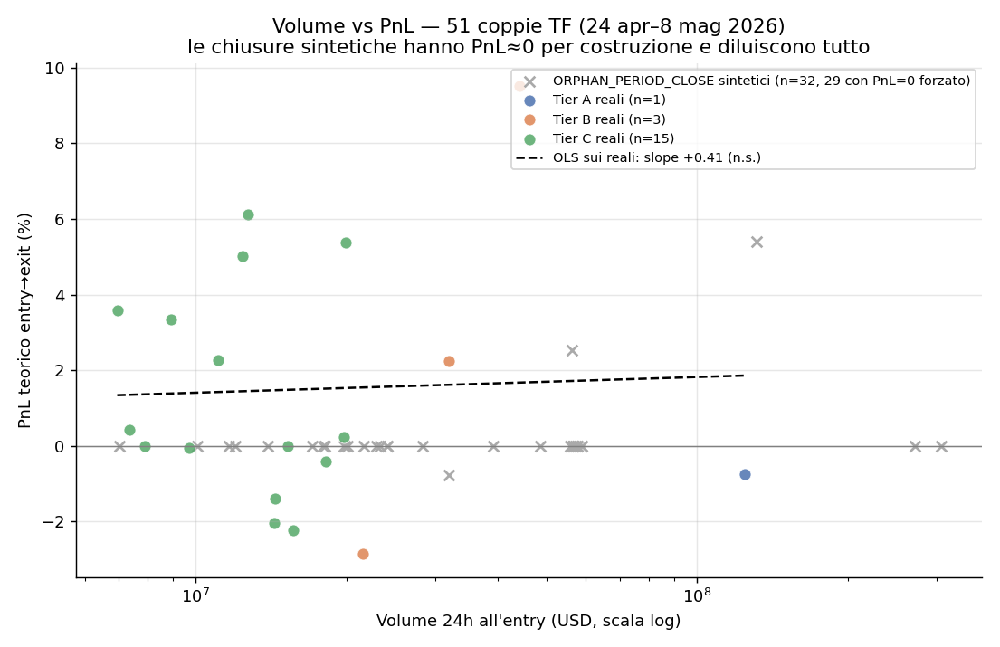
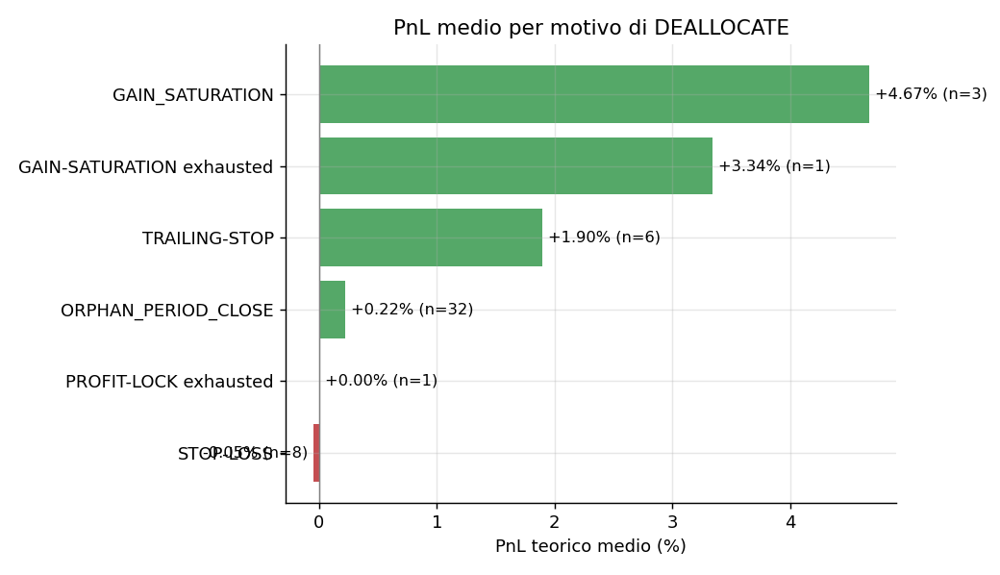
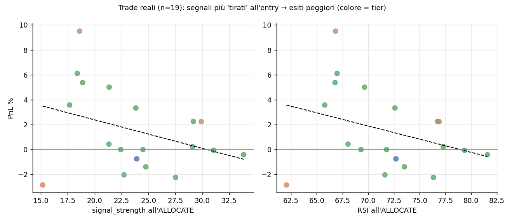
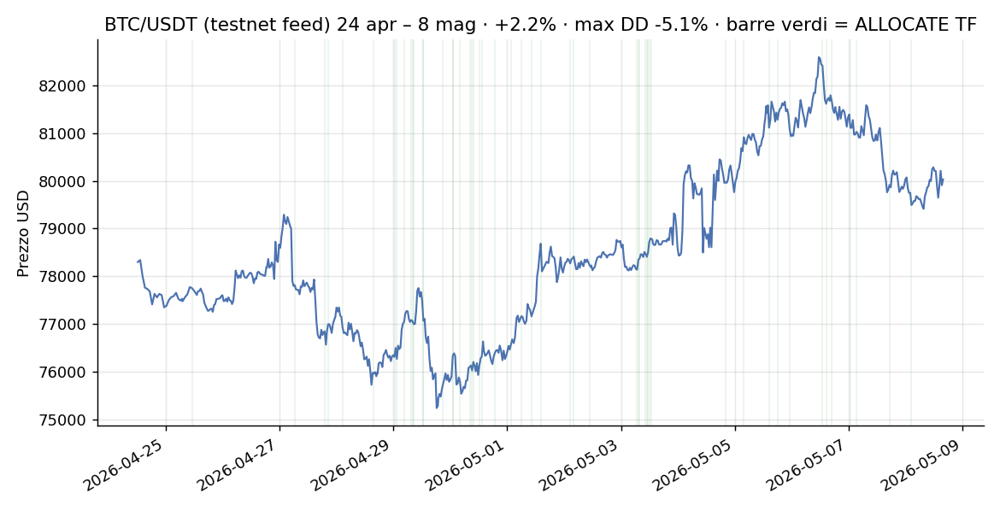
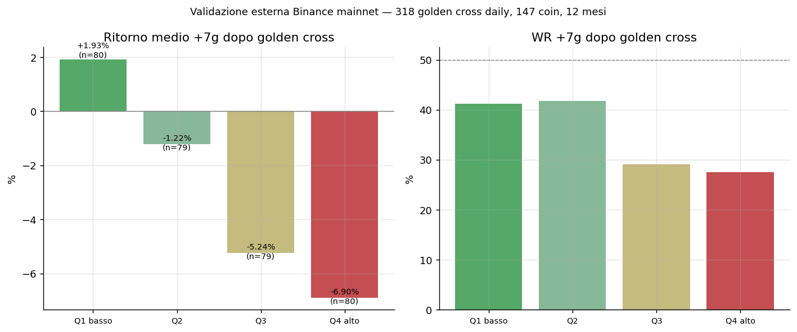
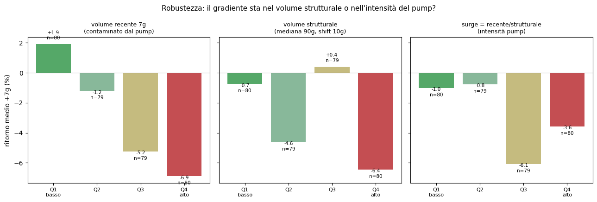
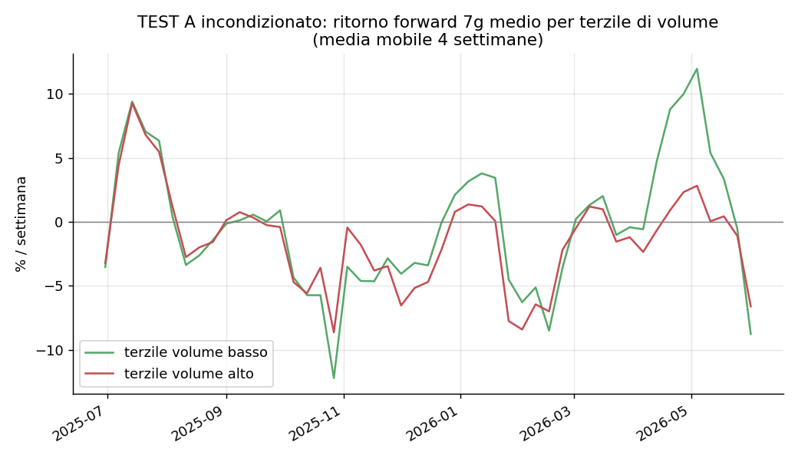

# Report S103a — Analisi correlazione Volume ↔ PnL (paper trading + validazione esterna)

**Brief sorgente:** `config/2026-06-12_S103a_brief_volume-pnl-correlation.md`
**Sessione:** S103a (analisi, zero codice bot) · **Commit baseline repo:** `8ab59c0`
**Dati interni:** backup `/Volumes/Archivio/bagholderai_backups/2026-05-08_pre-reset-s67/` (trend_scans 32.257 righe, trend_decisions_log 1.412 righe, 24 apr–8 mag 2026)
**Dati esterni:** Binance mainnet API pubblica (no key, no registrazione), 162 symbol × 377 giorni (giu 2025–giu 2026)
**Asset:** grafici, CSV e script riproducibili in `report_for_CEO/assets/2026-06-12_S103a_volume-pnl/`

> ⚠️ Nota naming per l'Auditor: l'ID "S103a" è già usato oggi dal brief `sherpa-board-params`
> (shipped stamattina). Gli SCOPE sono diversi, quindi l'accoppiamento brief↔report regge,
> ma è la prima volta che un ID sessione viene riusato nello stesso giorno.

---

## TL;DR

**Il volume_24h NON è un fattore utilizzabile per filtrare i segnali del TF — in nessuna
direzione.** Tre livelli di evidenza convergono:

1. **Interno**: il pattern "Q1 basso volume → +1.33%, WR 43%" dell'esplorazione CEO è un
   **artefatto di composizione del campione**, non un segnale. Il 57% delle coppie
   ALLOCATE→DEALLOCATE ha PnL=0 *per costruzione* (righe sintetiche ORPHAN_PERIOD_CLOSE) e
   quei zeri si concentrano nei quartili di volume alto. Tolti gli orphan, il gradiente sparisce.
2. **Esterno** (Binance mainnet, 12 mesi, 318 golden cross): il gradiente raw c'è ed è
   persino "significativo" (p=0.0004), ma è **spurio due volte**: il driver è l'intensità
   del pump di volume (surge), non la liquidità della coin; e con la correzione per il
   clustering temporale degli eventi non resta nulla (p=0.82).
3. **Letteratura**: il claim incondizionato "low volume → rendimenti più alti" è noto e
   supportato (illiquidity premium / size effect), ma quello che il TF farebbe — comprare
   momentum su coin illiquide — è **semmai contraddetto**: il momentum crypto documentato
   vive nelle coin grandi e liquide; sulle illiquide domina il reversal.

**Raccomandazione: NON aggiungere un filtro volume allo scanner.** Unico candidato emerso
con qualche supporto (debole, p=0.09): un guard **anti-surge** che sopprima l'ALLOCATE
quando il volume recente è anomalo rispetto alla norma della coin. Da NON implementare ora —
eventuale ri-test post-verdetto barometro. Decisione al Board.

**Bonus involontario ma importante**: sui cicli chiusi davvero dal mercato, il TF del
periodo aveva **WR 52.6% e PnL teorico +1.49%** — non WR 26.8% / +0.68%. I numeri
dell'esplorazione erano schiacciati dagli zeri sintetici.

---

## 0. Obiezione anti-assenso (dichiarata prima dell'analisi)

Nel TF **il tier è definito dal volume** (`trend_config`: Tier 1/A ≥ $100M, Tier 2/B ≥ $20M,
Tier 3/C < $20M). "Tier C performa meglio" e "il basso volume performa meglio" sono quindi
in larga parte la stessa osservazione per costruzione: il valore aggiunto poteva stare solo
nell'analisi *within-tier* e nella validazione esterna. L'analisi è stata impostata di
conseguenza (OLS con dummies tier, correlazioni per tier, test esterni). L'obiezione si è
poi rivelata secondaria rispetto all'artefatto orphan (§1), che domina tutto il resto.

---

## 1. Il finding che cambia la lettura: le righe ORPHAN_PERIOD_CLOSE

Ricostruendo le coppie ALLOCATE→DEALLOCATE (54 coppie, 51 con match prezzo ±6h; il CEO ne
aveva trovate 56 — stessa popolazione, pairing leggermente diverso):

- **32 coppie su 51 (63%) sono chiuse da `ORPHAN_PERIOD_CLOSE`**, la riga *sintetica*
  che il sistema scrive per chiudere amministrativamente un ciclo rimasto senza DEALLOCATE
  ("previous cycle ended without DEALLOCATE row").
- **29 di queste 32 hanno il timestamp di chiusura ≈ timestamp di ALLOCATE** (durata 0.0h)
  → entry price = exit price → **PnL = 0 per costruzione**. Non sono trade misurabili:
  sono buchi amministrativi. Quando il ciclo sia davvero finito, e a che prezzo, i dati
  non lo dicono.
- Gli orphan **non sono distribuiti uniformemente sul volume**: 5/13 in Q1, 6/13 in Q2,
  9/12 in Q3, **12/13 in Q4** (χ² p=0.015; Spearman volume↔orphan +0.46, p=0.0007).

**Conseguenza diretta**: nel campione completo, Q1 contiene quasi tutti i trade veri e Q4
quasi solo zeri sintetici. Il "gradiente" Q1 +1.33% → Q4 +0.96% confrontava trade reali
con righe a PnL forzato a zero. Il Q4 del campione completo si regge su **una sola coppia
reale**.

I numeri preliminari del CEO **replicano** (51 coppie: WR 23.5%, PnL +0.70% vs 56 coppie:
WR 26.8%, +0.68% — stessa sostanza): l'esplorazione non aveva errori di calcolo, aveva
dentro dati non-misurabili che nessuno aveva ancora flaggato.

> **Nota di igiene dati per il futuro**: chiunque analizzi `trend_decisions_log` deve
> escludere (o trattare separatamente) le righe `ORPHAN_PERIOD_CLOSE`. Vale anche per
> eventuali analisi future post-go-live.

---

## 2. Analisi interna sui dati validi (19 cicli chiusi dal mercato)

Campione onesto: **19 cicli** con chiusura di mercato (stop-loss, trailing, gain
saturation, profit-lock). Pochi, ma veri.

| Metrica | Campione completo (51) | Solo trade reali (19) |
|---|---|---|
| Win rate | 23.5% | **52.6%** |
| PnL teorico medio | +0.70% | **+1.49%** |
| PnL mediano | 0.00% (gli zeri sintetici) | +0.23% |

### 2.1 Correlazione volume ↔ PnL: zero ovunque

| Sottocampione | n | Pearson (log₁₀ vol) | Spearman | p |
|---|---|---|---|---|
| Tutti | 51 | −0.007 | −0.074 | 0.96 / 0.60 |
| Senza orphan | 19 | +0.038 | −0.172 | 0.88 / 0.48 |
| Tier B | 22 | +0.196 | +0.195 | 0.38 / 0.39 |
| Tier C | 25 | −0.160 | −0.183 | 0.45 / 0.38 |

- OLS `pnl ~ log₁₀(volume) + tier`: coefficiente volume β=−0.24, p=0.90 → il volume non
  aggiunge nulla oltre il tier (e nemmeno il tier è significativo).
- Q1 vs Q4 (campione completo): diff +1.04 p.p., bootstrap 95% CI [−0.38, +2.45],
  Mann-Whitney p=0.18 → indistinguibile dal rumore.
- Sui 19 trade reali, in terzili: T1 basso +1.59% (WR 67%) · T2 +0.91% (33%) ·
  **T3 alto +1.91% (57%)** → nessun gradiente; il terzile di volume più alto è il migliore.

> ⚠️ **Segnalazione richiesta dal brief (finding inatteso, non interpretato)**: nel
> breakdown per tier il segno della correlazione **si inverte tra Tier B (+0.20) e
> Tier C (−0.18)**. Entrambe non significative (p≈0.38): con questi n è il comportamento
> atteso del rumore, ma lo segnalo come da istruzione senza interpretarlo.

### 2.2 Cosa misura davvero il "PnL teorico" (limite importante)

Il PnL entry→exit ai prezzi scan misura **il movimento del prezzo della coin nella
finestra del ciclo**, non il realized del bot. Cross-check con i `realized $` scritti nei
reason dei DEALLOCATE (n=16): concordanza di segno solo 44%, Spearman 0.38 (p=0.15).
Le ragioni della divergenza sono strutturali: il TF compra/vende in lotti scaglionati
(greed decay, trailing parziali), mentre il PnL teorico usa un prezzo unico di entry e di
exit. Esempio: AR/USDT, prezzo +5.4% tra entry e exit, realized −$0.21. Per la domanda del
brief ("il volume predice l'esito del segnale?") il PnL-prezzo è la misura giusta; per
giudicare la *redditività del bot* non lo è. Match prezzi comunque solido: mediana 0.1–0.2
minuti di distanza (le decisioni nascono dagli scan stessi).

### 2.3 Analisi complementari (sui 19 reali dove sensato)

- **Durata**: win mediamente lunghe (20.9h media, mediana 6.2h), loss rapide (1.2h media)
  — coerente con stop-loss 2.5% che taglia presto e trailing che lascia correre.
- **signal_strength all'ALLOCATE**: correlazione *negativa* col PnL (Spearman −0.18,
  p=0.21). Split alla mediana (23.8): sotto → +1.40%, WR 35%; sopra → −0.04%, WR 12%.
- **RSI all'ALLOCATE**: idem, −0.21 (p=0.13). Sotto la mediana (71.8) → +1.27%, WR 31%;
  sopra → +0.10%, WR 16%. Nota: metà degli ALLOCATE entra con RSI > 72 — il cap attuale
  `tf_rsi_1h_max=75` taglia solo la coda estrema. Il TF alloca lo "strongest BULLISH",
  cioè compra sistematicamente il punto di massima estensione. Campione piccolo e p>0.05:
  **osservazione, non finding** — ma è più promettente del volume come pista futura.
- **Motivi di DEALLOCATE** (51 coppie): ORPHAN 32 (PnL ≈ 0 per costruzione) ·
  STOP-LOSS 8 (PnL medio −0.05%, peggiore −2.84% → **lo stop a 2.5% contiene le perdite
  come da design**) · TRAILING-STOP 6 (+1.90%, WR 67%) · GAIN_SATURATION 3+1 (+4.3%,
  WR 100%, le uscite migliori) · PROFIT-LOCK 1. Le "perdite peggiori" stanno tutte negli
  stop-loss, ma il loro floor è esattamente dove il design lo mette. I 6 ALLOCATE_FAILED
  del periodo sono tutti errori di write su `bot_config` (constraint violato, 5×TAO 1×TRX)
  — non c'entrano col mercato.

### 2.4 Contesto di mercato del periodo (24 apr – 8 mag 2026)

Dal feed dei nostri scan (BTC/USDT, 655 osservazioni): **+2.2%** start→end, range 9.8%,
max drawdown −5.1%, vol giornaliera 1.26% → **laterale-rialzista con un dip**. Cross-check
mainnet (klines Binance): +3.6% sullo stesso periodo, min/max coerenti → il feed testnet
specchiava decentemente il mainnet. **Un solo regime**: l'auto-obiezione del CEO nel brief
("pattern che vale solo in fase laterale/rialzista?") era fondata — ed è esattamente il
motivo per cui la validazione esterna multi-regime (§3) era necessaria.

---

## 3. Validazione esterna (Binance mainnet, giu 2025 – giu 2026)

**Setup**: universo = i 163 symbol visti dallo scanner TF nel backup; klines daily 12 mesi
da `api.binance.com` (API pubblica, nessuna key/registrazione → vincolo brief rispettato).
162/163 scaricati, 1 errore di rete, **0 delisted** — survivorship contenuto *sull'universo
scelto*, ma l'universo stesso (coin vive ad apr 2026) esclude per costruzione le coin morte
prima: i rendimenti delle fasce basse restano sovrastimati (la letteratura quantifica il
bias fino a +62%/anno nei backtest equal-weighted, §4).

### 3.1 TEST A — incondizionato (senza segnale)

Ogni lunedì, rank dei 162 symbol per volume medio 7g → terzili → ritorno forward 7g
(52 settimane, 7.574 coin-settimane): terzile basso −0.77%, medio −2.05%, alto −1.76%
(mercato mediamente negativo nel periodo). Spread settimanale basso−alto: **+0.93
p.p./settimana (t=1.73, p=0.089)** — direzione coerente con l'**illiquidity premium**
della letteratura, grandezza marginale. È un fenomeno da *holder/liquidity provider di
portafoglio*, non un segnale di timing per un bot momentum (vedi §4: quel premio un
market-taker lo paga, non lo incassa).

### 3.2 TEST B — condizionato (proxy del segnale TF)

Evento = **golden cross EMA20/50 daily** (proxy direzionale del BULLISH del TF, che opera
su scan 30min con strength ≥15 — replica fedele impossibile dai dati daily, dichiarato).
318 eventi su 147 symbol in 12 mesi.

**Risultato raw** (quartili di volume 7g al giorno del cross, come l'esplorazione CEO):

| Quartile | n | fwd 7g medio | mediana | WR |
|---|---|---|---|---|
| Q1 basso | 80 | **+1.93%** | −2.73% | 41% |
| Q2 | 79 | −1.22% | −2.05% | 42% |
| Q3 | 79 | −5.24% | −5.13% | 29% |
| Q4 alto | 80 | **−6.90%** | −7.36% | 28% |

Q1−Q4 = +8.82 p.p., Mann-Whitney p=0.0004, Spearman −0.24 (p<0.0001), stabile nei due
semestri. *Sembra* la conferma del pattern CEO. **Non lo è** — due controlli di robustezza
lo smontano:

**(a) Il driver è il pump, non la liquidità.** Il volume "7g al cross" è contaminato dal
rally che il cross stesso fotografa. Ristratificando per **volume strutturale** (mediana
90g, shiftata di 10g — la liquidità *normale* della coin) il gradiente non è più monotono
e non è significativo (Q1−Q4 p=0.17, Spearman −0.06 p=0.26). Per **surge**
(volume recente ÷ strutturale = intensità dell'esplosione): Spearman −0.215, p=0.0001.
Doppio sort alla mediana:

|  | surge basso | surge alto |
|---|---|---|
| **struct BASSO** | **+3.65%** (n=51) | −5.66% (n=108) |
| **struct ALTO** | −3.04% (n=108) | −3.04% (n=51) |

Il segnale sta nella colonna (surge), non nella riga (liquidità): un cross accompagnato da
volume esploso è mediamente una bull-trap (mean reversion post-pump). L'unica cella
positiva (+3.65%) ha **mediana −2.79%**: la media la fanno 2-3 outlier lottery (un evento
di ott 2025 a +54%) — il profilo che la letteratura associa alle dinamiche pump-and-dump,
non una base per un filtro.

**(b) Gli eventi arrivano a grappoli** (il mercato gira → decine di coin crossano insieme):
i p-value sopra assumono indipendenza che non c'è. Aggregando per mese: lo spread Q1−Q4 sul
volume strutturale fa **−0.85 p.p. medi, positivo solo in 4/7 mesi (p=0.82)** → morto.
L'anti-surge (no-surge − surge) sopravvive meglio: **+5.72 p.p./mese, positivo 6/8 mesi,
ma t=1.95, p=0.092** → suggestivo, sotto soglia.

---

## 4. Validazione esterna — letteratura

Ricerca dedicata (agente di ricerca, fonti verificate; numeri estratti da abstract/summary
— per uso decisionale pesante consiglio verifica puntuale sui PDF). Sintesi:

**Il pattern ha un nome, ma va spezzato in due claim:**

- **Claim 1 — "coin a basso volume/size rendono di più in media" (incondizionato):
  SUPPORTATO.** Si chiama **illiquidity premium** (Amihud 2002, *J. Financial Markets*)
  e, nella variante per capitalizzazione, **size effect** (Banz 1981 per le azioni). Per
  le crypto: Liu, Tsyvinski & Wu 2022 (*Journal of Finance*) — spread small-minus-big
  **−3.4%/settimana** a favore delle piccole; Zhang & Li 2023 (illiquidità Amihud prezzata);
  replica practitioner Quant Buffet 2024. Spiegazioni: compenso per costi di
  transazione/rischio liquidità, inventory risk, neglect, limits to arbitrage.
- **Claim 2 — "dopo un segnale bullish/momentum, le low-volume rendono di più"
  (condizionato — ciò che il TF farebbe): NON SUPPORTATO, semmai contraddetto.**
  LTW 2022: momentum significativo solo nelle coin **sopra**-mediana per size
  (4.2%/sett. vs 0.6% n.s. nelle piccole). Begušić & Kostanjčar 2019: momentum nelle coin
  *liquide*, **reversal** nelle illiquide. Fieberg et al. 2024 (*JFQA*): il trend factor
  crypto persiste nelle coin grandi e liquide. Nessuno studio testa l'esatto "EMA20>50 per
  fascia di volume" → contraddizione per analogia, non smentita diretta.

**Caveat che pesano direttamente su di noi:**

1. **Survivorship/delisting**: Ammann et al. 2022 — bias fino a **+62%/anno** nei
   portafogli equal-weighted di microcap (solo 1 crypto su 4 del 2014 è ancora listata).
2. **Pump-and-dump**: Dhawan & Putniņš 2023 (*Review of Finance*) — 355 pump in 6 mesi,
   target preferenziale coin piccole/illiquide, rendimento atteso dei partecipanti
   **negativo**. Un EMA cross su una coin <$20M intercetta facilmente l'inizio di un pump:
   PnL di backtest positivo, non replicabile, coda sinistra severa. (Coerente con il
   nostro doppio sort: surge → −5.66%.)
3. **Il premio low-volume è di chi FORNISCE liquidità** (Bianchi, Babiak & Dickerson 2022,
   *J. Banking & Finance*: rendimenti del reversal concentrati nelle coppie a basso volume,
   0.65% vs −0.19%): un bot momentum market-taker quel premio lo **paga** (spread/slippage),
   non lo incassa. Su testnet lo slippage BONK osservato è 2.5-4% — su mainnet microcap lo
   spread reale erode esattamente il margine che il backtest mostra.
4. **Regime-dipendenza**: Fieberg, Liedtke & Zaremba 2024 — le anomalie size/volume crypto
   si concentrano nei bull market e decadono nel tempo; vengono quasi solo dalle microcap
   "di importanza economica trascurabile".

### Bibliografia essenziale

1. Liu, Tsyvinski, Wu (2022). "Common Risk Factors in Cryptocurrency". *J. Finance* 77(2). — [Wiley](https://onlinelibrary.wiley.com/doi/abs/10.1111/jofi.13119) · [NBER WP](https://www.nber.org/system/files/working_papers/w25882/w25882.pdf)
2. Zhang, Li (2023). "Liquidity risk and expected cryptocurrency returns". *Int. J. Finance & Economics* 28(1). — [Wiley](https://onlinelibrary.wiley.com/doi/abs/10.1002/ijfe.2431)
3. Bianchi, Babiak, Dickerson (2022). "Trading volume and liquidity provision in cryptocurrency markets". *J. Banking & Finance* 142. — [ScienceDirect](https://www.sciencedirect.com/science/article/abs/pii/S0378426622001418)
4. Begušić, Kostanjčar (2019). "Momentum and liquidity in cryptocurrencies". — [arXiv:1904.00890](https://arxiv.org/abs/1904.00890)
5. Fieberg, Liedtke, Poddig, Walker, Zaremba (2024). "A Trend Factor for the Cross-Section of Cryptocurrency Returns". *JFQA*. — [Cambridge](https://www.cambridge.org/core/journals/journal-of-financial-and-quantitative-analysis/article/trend-factor-for-the-cross-section-of-cryptocurrency-returns/4C1509ACBA33D5DCAF0AC24379148178)
6. Fieberg, Liedtke, Zaremba (2024). "Cryptocurrency anomalies and economic constraints". *IRFA* 94. — [ScienceDirect](https://www.sciencedirect.com/science/article/abs/pii/S1057521924001509)
7. Dhawan, Putniņš (2023). "A New Wolf in Town? Pump-and-Dump Manipulation in Cryptocurrency Markets". *Review of Finance* 27(3). — [OUP](https://academic.oup.com/rof/article-abstract/27/3/935/6655707)
8. Ammann, Burdorf, Liebi, Stöckl (2022). "Survivorship and Delisting Bias in Cryptocurrency Markets". — [SSRN 4287573](https://papers.ssrn.com/sol3/papers.cfm?abstract_id=4287573)
9. Amihud (2002). "Illiquidity and stock returns". *J. Financial Markets* 5. — [PDF](https://www.cis.upenn.edu/~mkearns/finread/amihud.pdf)
10. Gervais, Kaniel, Mingelgrin (2001). "The High-Volume Return Premium". *J. Finance* 56(3) — [SSRN](https://papers.ssrn.com/sol3/papers.cfm?abstract_id=146468) (equity: shock di volume ALTO → rendimenti alti; misura *within-stock*, non contraddice l'illiquidity premium cross-sectional)
11. Banz (1981). "The relationship between return and market value of common stocks". *JFE* 9. — [ScienceDirect](https://www.sciencedirect.com/science/article/abs/pii/0304405X81900180)
12. Hou, Xue, Zhang (2020). "Replicating Anomalies". *RFS* 33(5) — il 96% delle anomalie equity da "trading frictions" muore neutralizzando le microcap. — [PDF](https://global-q.org/uploads/1/2/2/6/122679606/houxuezhang2020rfs.pdf)
13. Quant Buffet (2024). "Cryptocurrency Low-Volume Liquidity Risk Premium Strategy". — [quantbuffet.com](https://quantbuffet.com/en/2024/12/24/scaled-volume-in-cryptos/)
14. Ozdamar et al. 2021 ([MAX effect crypto](https://jfin-swufe.springeropen.com/articles/10.1186/s40854-021-00291-9)); Grobys & Junttila 2021 ([opposto su top-20](https://www.sciencedirect.com/science/article/pii/S1042443121000081)) — evidenza lottery contrastante.

---

## 5. Risposte alle domande del brief

**Il volume è un fattore utilizzabile per filtrare i segnali del TF?**
**No.** Internamente la correlazione è zero su ogni sottocampione e il pattern
dell'esplorazione era un artefatto di composizione (orphan). Esternamente il gradiente raw
è guidato dall'intensità del pump e muore con la correzione per clustering. La letteratura
contraddice il claim condizionato.

**Se sì, in quale direzione (alto o basso volume)?**
Nessuna delle due. Per completezza: la direzione "favorire basso volume" — quella suggerita
dall'esplorazione — è proprio quella che la letteratura sconsiglia per un bot momentum
taker (premio da liquidity provider + pump-and-dump + slippage che mangia il margine).

**Vale la pena aggiungere un filtro volume allo scanner? Quale soglia/logica?**
**No, nessun filtro volume direzionale.** L'unico candidato emerso con supporto parziale è
diverso: un **guard anti-surge** — sopprimere/penalizzare l'ALLOCATE quando
`vol7 / mediana(vol 90g)` supera una soglia (es. >2-3×), cioè quando il cross cavalca
un'esplosione anomala di volume. Evidenza: +5.72 p.p./mese, 6/8 mesi positivi, **p=0.092**
— sotto soglia, non sufficiente per implementare. Proposta: parcheggiarlo come ipotesi
falsificabile e ri-testarlo con più dati (post-verdetto barometro, eventualmente su dati
live accumulati). **Come da brief, non implemento nulla: decisione al Board.**

**Cosa dice la validazione esterna?**
§3-§4: illiquidity premium incondizionato visibile anche nei nostri dati esterni (+0.93
p.p./sett, p=0.089, coerente con la letteratura) ma non actionable per il TF; claim
condizionato non robusto.

---

## 6. Decisions (decision log)

**DECISIONE 1**: escludere le 32 righe ORPHAN_PERIOD_CLOSE dal campione inferenziale
(tenute solo nella replica dell'esplorazione CEO e nella distribuzione motivi).
RAZIONALE: 29/32 hanno PnL=0 per costruzione (timestamp exit ≈ entry); includerle
significa misurare la composizione del campione, non il mercato.
ALTERNATIVE: tenerle (replica CEO — fatto, come confronto); imputare l'exit al prezzo di
fine periodo (scartata: inventa un'uscita mai avvenuta).
FALLBACK: `pairs.csv` contiene tutto con flag `is_orphan` — ogni scelta è reversibile.

**DECISIONE 2**: validazione esterna su **Binance public API** invece di CoinGecko/CMC.
RAZIONALE: zero key/registrazione (il brief impone di chiedere prima per API con key —
non è servito); quote volume USDT nativo della coppia = stessa metrica dello scanner;
stesso exchange del bot.
ALTERNATIVE: CoinGecko free (rate limit aggressivo, volumi aggregati cross-exchange non
comparabili); CMC (key obbligatoria).
FALLBACK: script parametrico, riusabile con altra fonte.

**DECISIONE 3**: proxy del segnale TF = golden cross EMA20/50 **daily** (evento cross-up).
RAZIONALE: il TF reale usa EMA20/50 su scan 30min + strength ≥15, non replicabile da
klines daily; il cross-up daily è l'evento direzionalmente analogo ("nuovo BULLISH").
ALTERNATIVE: klines 30m × 12 mesi × 162 symbol (~3.000 richieste, replica comunque
imperfetta senza la formula strength: scartata per costo/beneficio).
FALLBACK: dichiarato come proxy nel report; chi vuole la replica esatta ha lo script.

**DECISIONE 4**: doppio controllo di robustezza (volume strutturale vs surge + clustering
mensile) prima di accettare il risultato esterno raw.
RAZIONALE: il p=0.0004 raw sarebbe finito nel report come "conferma" — era spurio.
Auto-critica preventiva = il lavoro che l'Auditor avrebbe fatto dopo.

---

## 7. Limiti

1. **n=19** trade reali interni: qualunque pattern interno è indicativo, mai conclusivo.
2. Il PnL interno è **teorico** (prezzo scan→scan): non include fee/slippage e non
   coincide col realized del bot (§2.2). Su microcap mainnet lo slippage cambierebbe il segno
   di molti trade marginali.
3. L'universo esterno è **survivorship-selected** (coin vive ad apr 2026): i rendimenti
   delle fasce basse sono sovrastimati; il verdetto negativo ne esce semmai rafforzato.
4. Il proxy daily non replica il segnale TF intraday; i forward return 3/7g non replicano
   stop-loss/trailing del TF.
5. Periodo esterno = 12 mesi prevalentemente laterali/ribassisti per le altcoin; il
   semestre-split mitiga ma non elimina la regime-dipendenza.
6. I numeri citati dalla letteratura provengono da abstract/summary verificati via web,
   non da lettura integrale dei PDF.

## 8. Riproducibilità

In `report_for_CEO/assets/2026-06-12_S103a_volume-pnl/`:
`analyze_internal.py` (pairing, correlazioni, grafici 01-05) · `make_final_charts.py`
(versioni finali 01/02/05) · `analyze_external.py` (download Binance + test A/B, grafici
06-07) · `robustness_external.py` (surge/strutturale/clustering, grafico 08) ·
`pairs.csv` (51 coppie con flag) · `external_events.csv` (318 eventi).
Ambiente: Python 3 + pandas/scipy/matplotlib (venv usa-e-getta, niente dipendenze del bot).
Vincoli rispettati: zero scritture Supabase, zero touch codice bot/scanner/Sentinel,
zero restart, nessuna API key.
